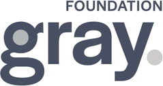

# Funding

[//]: # Describe the funding sources relevant for your work. 

Minerva has been developed with support from:

* Gates Foundation
* Gray Foundation
* NIH grant U01CA284207-01 & [Informatics Technology for Cancer Research (ITCR) Training Network](https://www.itcrtraining.org/home)
* NIH grant U2C-CA233262
* NIH grant U2CCA233280
* Ludwig Cancer Center at Harvard

 

 

 

<!-- end grid -->

 

<!-- end grid -->