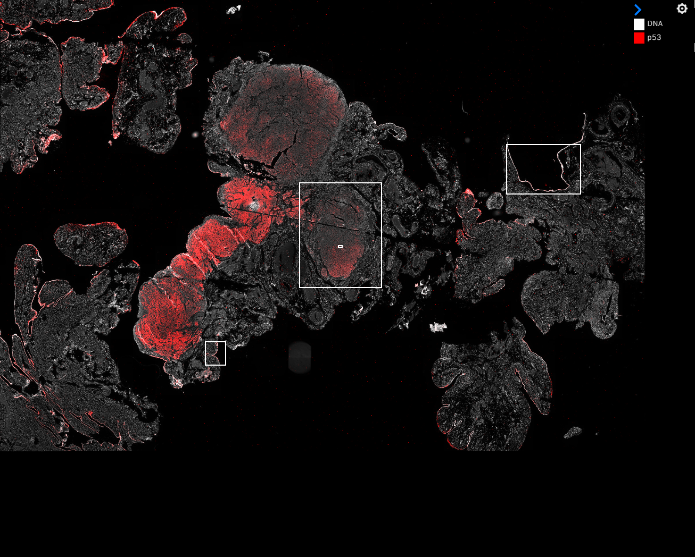
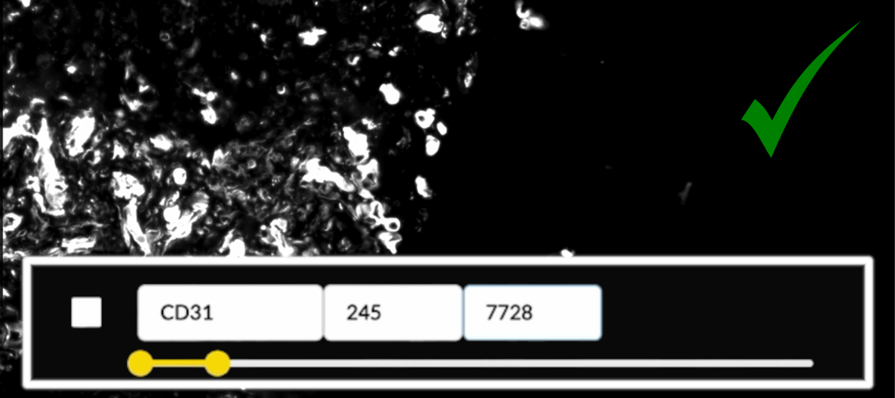

  

    Table of contents
  

  {: .text-delta }
  - TOC
{:toc}

# What's Minerva?
Minerva is a suite of light-weight software tools that enables interactive viewing and fast sharing of large image data. It comprises of **Minerva Author**, a tool that lets you easily create and annotate images, and **Minerva Story**, a narrative image viewer for web hosting.

Minerva is built to support the image data sharing for tissue atlases and digital pathology. 

<iframe src="https://player.vimeo.com/video/685606030?badge=0&amp;autopause=0&amp;quality_selector=1&amp;progress_bar=1&amp;player_id=0&amp;app_id=58479" frameborder="0" allow="autoplay; fullscreen; picture-in-picture" style="position:absolute;top:0;left:0;width:100%;height:100%;" title="Data Visualization and Sharing with MINERVA"></iframe>

[//]: # # Why?

[//]: # What was the current need in the field that motivated the development? Start out by setting the scene. End by describing how your [//]: # software fills this gap.

# Anatomy of a Minerva Story

{: .fs-5 }
{: .fw-300 }
Click on areas of this **Minerva Story** interface to learn more about each part.

<svg xmlns="http://www.w3.org/2000/svg" xmlns:sodipodi="http://sodipodi.sourceforge.net/DTD/sodipodi-0.dtd" xmlns:inkscape="http://www.inkscape.org/namespaces/inkscape" viewBox="0 0 466 250" inkscape:version="0.92.4 (5da689c313, 2019-01-14)" sodipodi:docname="screenshot-2-imgmap.svg" style="background-image: url(../images/minerva-screenshot-2.png)">

<defs>

</defs>

<a xlink:href="#narrated-waypoints">
<title>Narrated Waypoints</title>
<path d="M 0.22864845,71.602882 V 249.96054 H 98.889724 V 71.602882 Z" inkscape:connector-curvature="0" transform="translate(0 -47)"/>
</a>

<a xlink:href="#curated-frame-of-view">
<title>Curated Frame of View</title>
<path d="M 108.35847,73.919121 V 294.77264 H 317.13458 V 73.919121 Z" inkscape:connector-curvature="0" transform="translate(0 -47)"/>
</a>

<a xlink:href="#channel-tuning">
<title>Channel Tuning</title>
<path d="m 317.13458,71.802452 v 45.993938 h 42.46917 V 71.802452 Z" inkscape:connector-curvature="0" transform="translate(0 -47)"/>
</a>

<a xlink:href="#channel-groups">
<title>Channel Groups</title>
<path d="M 361.27806,71.652832 V 254.73324 h 53.81215 V 71.652832 h -53.81215" inkscape:connector-curvature="0" transform="translate(0 -47)"/>
</a>

</svg>

## Curated frame of view

Whole slide tissue images contain massive amounts of information. For some audience, a birds-eye perspective of the whole slide can be overwhelming and therefore counter intuitive. For each waypoint of the Minerva Story, you have the option of guiding your audience through the image, directing their attention to the salient details of the data. 

### Initial waypoint

The first waypoint of a **Minerva Story** is akin to a first impression. You may choose to display an area of the sample that's both recognizable and meaningful for the narrative of the story.

 

{: .fs-3 }
{: .fw-300 }
An example of a birds-eye view of the whole slide

 

{: .fs-3 }
{: .fw-300 }
An example of a curated field of view where cellular-level detail is visible

<!-- end grid -->

## Channel tuning

When the viewer selects a waypoint, they are first shown a set of markers, called a channel group, selected by the author of the **Minerva Story** to company that field of view. 

The appropriate range of channel intensities is vital for understanding the image data. Screens can only display 1/256 of the range of intensity values in source images, so Minerva must choose subset of intensities to display. At the beginning of authoring each **Minerva Story**, **Minerva Author** will automatically suggest a range of intensities to display for each channel.

 

{: .fs-3 }
{: .fw-300 }
An example of dynamic range suggested by the built-in algorithm of Minerva

 

{: .fs-3 }
{: .fw-300 }
For contrast, a dynamic range that would be too bright for the same area of interest

 

{: .fs-3 }
{: .fw-300 }
And an example that shows a range too dark for this area

<!-- end grid -->

### Custimizing channels

The viewer also has the option of curating the markers and the colors they appear in. 

By clicking the ⚙️ icon on the top right of the channel group box, viewer can see options to turn on/off each marker, customize their colors, and add additional markers available for this image.

{: .fs-3 }
{: .fw-300 }
Clicking the ⚙️ icon brings up options to turn on/off channels and customize colors

 

{: .fs-3 }
{: .fw-300 }
Clicking the plus sign brings up a list of other markers available to add to the display

<!-- end grid -->

## Channel Groups

When the viewer selects a waypoint, they are first shown a set of markers, called a channel group, selected by the author of the **Minerva Story** to company that field of view. The viewer also has the option of curating the markers and the colors they appear in. 

## Narrated waypoints

**Minerva Story** displays a narrative guide that you create to help your viewer contextualize and interpret the image data. 

### Introductory content

For your viewers, a **Minerva Story** starts with the Sample Description you provide when authoring the story. This introductory text gives an overview to your data and its story. You can also use plain language to provide context with essential metadata (e.g. diagnosis, demographic etc.).

 

{: .fs-3 }
{: .fw-300 }
Example of introductory text providing essential metadata. [*Ovarian Cancer with Annotation*](www.cycif.org/data/gray-stic-1)

 

{: .fs-3 }
{: .fw-300 }
Example of introductory text from [a Story on lung cancer](www.cycif.org/data/du-lin-rashid-nat-protoc-2019/osd-LUNG_3_DATA.html)

### Metadata

Metadata provides crucial context for your audience to understand the image data. You can provide a list of most relevant metadata within your story. 

For tissue imaging, we recommend using the [MITI (Minimum Information about Tissue Imaging)](https://www.miti-consortium.org/) standard to guide your metadata selection.

 

{: .fs-3 }
{: .fw-300 }
Example of metadata in [Multimodal spatial profiling of colorectal cancer using Orion](www.tissue-atlas.org/orion-crc-1) Story.

### Attribution

A **Minerva Story** is a publication in its own right. The story author list will likely be different from the manuscript or the data its based on. You can define a preferred way for others to cite your story by including anyone who contributed directory to the story as an author. This could include people who helped conceptualize, write or tune the data.

Of course, you will also want to cite the data used in the story, whether is it from a published manuscript or unpublished data.

{: .fs-3 }
{: .fw-300 }
Two examples of attribution in Minerva Stories

<!-- end grid -->

# How does Minerva work?

Minerva follows a client-server model for delivering content. Images in OME-TIFF or SVS format are imported into **Minerva Author** where a user sets image settings and annotations. **Minerva Author** then renders image pyramids and a configuration file that is read by **Minerva Story** to deliver the content to viewers.

{: .fw-300 }
Minerva is available under the MIT License. It can be downloaded on the [Download page](../usage/download.md) or on GitHub at [https://github.com/labsyspharm/minerva-story](https://github.com/labsyspharm/minerva-story).

 

# Learn More
**View the [detailed computational methods](./detailed-methods.html) for more information on how Minerva works.**
