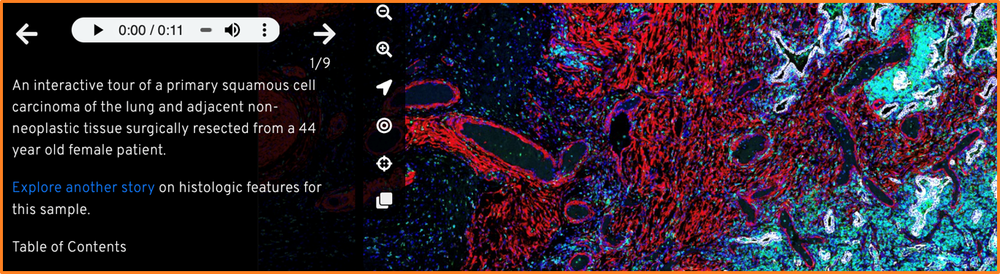

[//]: # The goal of this page is to give a simplified overview of your software. 
[//]: # You can probably pull a lot of this from your manuscript, but you probably do not want to show entire figures. Think about which components of which figures are necessary to give readers an overview of the software, isolate those components, and insert them here?
[//]: # Ideally, this will description will rely on images more than text
[//]: # See [ASHLAR](https://labsyspharm.github.io/ashlar/overview/overview-land.html) for an example of this.

[//]: # Reach out to Juliann if you want help with this page!!

  

    Table of contents
  

  {: .text-delta }
  - TOC
{:toc}

# What's Minerva?
Minerva is a suite of light-weight software tools that enables interactive viewing and fast sharing of large image data. It comprises of **Minerva Author**, a tool that lets you easily create and annotate images, and **Minerva Story**, a narrative image viewer for web hosting.

Minerva is built to support the image data sharing for tissue atlases and digital pathology. 

<iframe src="https://player.vimeo.com/video/685606030?badge=0&amp;autopause=0&amp;quality_selector=1&amp;progress_bar=1&amp;player_id=0&amp;app_id=58479" frameborder="0" allow="autoplay; fullscreen; picture-in-picture" style="position:absolute;top:0;left:0;width:100%;height:100%;" title="Data Visualization and Sharing with MINERVA"></iframe>

[//]: # # Why?

[//]: # What was the current need in the field that motivated the development? Start out by setting the scene. End by describing how your [//]: # software fills this gap.

# Anatomy of a Minerva Story

A **Minerva Story** can have any combinations of the following components. 

## Introductory content

For your viewers, a **Minerva Story** starts with the Sample Description you provide when authoring the story. This introductory text gives an overview to your data and its story. You can also use plain language to provide context with essential metadata (e.g. diagnosis, demographic etc.).

 

{: .fs-3 }
{: .fw-300 }
Example of introductory text providing essential metadata. [*Ovarian Cancer with Annotation*](www.cycif.org/data/gray-stic-1)

{: .fs-3 }
{: .fw-300 }
Example of introductory text from [a Story on lung cancer](www.cycif.org/data/du-lin-rashid-nat-protoc-2019/osd-LUNG_3_DATA.html)

## Channel tuning

The appropriate range of channel intensities is vital for understanding the image data. Screens can only display 1/256 of the range of intensity values in source images, so Minerva must choose subset of intensities to display. At the beginning of authoring each **Minerva Story**, **Minerva Author** will automatically suggest a range of intensities to display for each channel.

## Initial waypoint

Whole slide tissue images contain massive amounts of information. For some audience, a birds-eye perspective of the whole slide can be overwhelming and therefore counter intuitive. The first waypoint of a **Minerva Story** is akin to a first impression. You may choose to display an area of the sample that's both recognizable and meaningful for the narrative of the story.

<!-- end grid -->

## Narrated Waypoints

## Metadata

Metadata provides crucial context for your audience to understand the image data. You can provide a list of most relevant metadata within your story. 

For tissue imaging, we recommend using the [MITI (Minimum Information about Tissue Imaging)](https://www.miti-consortium.org/) standard to guide your metadata selection.

{: .fs-3 }
{: .fw-300 }
Example of metadata in [Multimodal spatial profiling of colorectal cancer using Orion](www.tissue-atlas.org/orion-crc-1) Story.

## Attribution

A **Minerva Story** is a publication in its own right. The story author list will likely be different from the manuscript or the data its based on. You can define a preferred way for others to cite your story by including anyone who contributed directory to the story as an author. This could include people who helped conceptualize, write or tune the data.

Of course, you will also want to cite the data used in the story, whether is it from a published manuscript or unpublished data.

<!-- end grid -->

# How does Minerva work?

Minerva follows a client-server model for delivering content. Images in OME-TIFF or SVS format are imported into **Minerva Author** where a user sets image settings and annotations. **Minerva Author** then renders image pyramids and a configuration file that is read by **Minerva Story** to deliver the content to viewers.

{: .fw-300 }
Minerva is available under the MIT License. It can be downloaded on the [Download page](../usage/download.md) or on GitHub at [https://github.com/labsyspharm/minerva-story](https://github.com/labsyspharm/minerva-story).

 

# Learn More
**View the [detailed computational methods](./detailed-methods.html) for more information on how each step is performed.**
