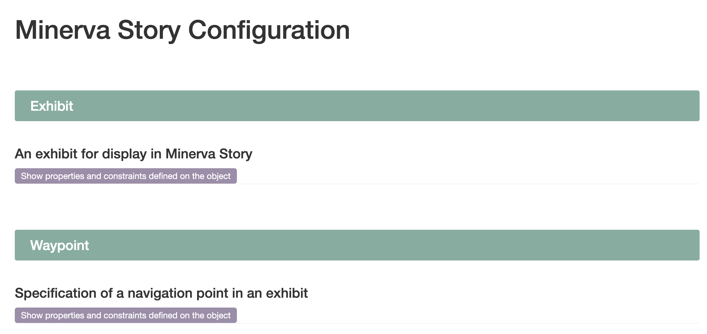

## Additional Customization

After your story is exported (with the "Publish" button), you can manually edit the `exhibit.json` file, which follows [this schema](https://labsyspharm.github.io/minerva-story/json-schema/exhibit/build/). Manual edits to the `exhibit.json` file allow further customization than possible with the user interface.

Here we list the <span style="color: #1DC690;">**Minerva Story**</span> customizations that are currently only available with this method. In time, we will add these features to the user interface.

### Lensing Configuration

<div style="padding:54.79% 0 0 0;position:relative;"><iframe src="https://player.vimeo.com/video/871934988?badge=0&amp;autopause=0&amp;quality_selector=1&amp;progress_bar=1&amp;player_id=0&amp;app_id=58479" frameborder="0" allow="autoplay; fullscreen; picture-in-picture" style="position:absolute;top:0;left:0;width:100%;height:100%;" title="Minerva H&amp;E lensing &amp; fade feature"></iframe></div><script src="https://player.vimeo.com/api/player.js"></script>

The above example shows an interactive H&E lens over a multi-channel CyCIF image. Configuring this lens is a two-step process.

#### Before you start, please note the following:
1. The lensing works best when the H&E image and CyCIF image come from the same or adjacent sections. The differences of the tissue features become more significant as the distance between the sections grows.
1. The alignment of the images are crucial for the final effect. For the following process to work, the two images need to have the same dimensions at a minimum. However, even with same size images, the features may require manual alignment. At the moment, we do not have a set procedure to recommend for the alignment process.

### Merging two stories

First, follow the [Tutorial](./tutorial.html) twice: for your CyCIF image, then for your H&E image. Ensure two images are the same width and height* (**See above*). Each process results in output formatted like [this example repository](https://github.com/thejohnhoffer/minerva-story-template/). From the "images/out" directory of the H&E output, copy the `HE-0_0__HE` folder to the "images/out" directory of the CyCIF output. Now, configure the CyCIF output's exhibit.json with this snippet added to the "Groups" list:

```
{
  "Name": "H&E",
  "Path": "HE-0_0__HE",
  "Colors": ["6000A0", "D030D0"],
  "Channels": ["Hematoxylin", "Eosin"]
}
```

Now, define "Hematoxylin" and "Eosin" with this snippet added to the "Channels" list:

```
{
  "Rendered": true, "Name": "Hematoxylin", "Path": "HE-0_0__HE"
},
{
  "Rendered": true, "Name": "Eosin", "Path": "HE-0_0__HE"
}
```

The CyCIF output now includes the H&E image as a separate channel.

### Adding the lens

You can add the "Lensing" configuration to specifc "Waypoints" or to the top of the exhibit.json with this line:

```json
"Lensing": {"Group": "H&E", "Rad": 100}
```

In this snippet, the radius of the lens is 100 pixels, but this can be customized. All waypoints with this configuration will show the interactive lens. If the "Lensing" is configured at the top level of the exhibit.json, the interactive lens will be shown at all waypoints.

## Further documentation

For more details, [view the full exhibit.json schema](https://labsyspharm.github.io/minerva-story/json-schema/exhibit/build).

<a href="https://labsyspharm.github.io/minerva-story/json-schema/exhibit/build">
  
</a>
