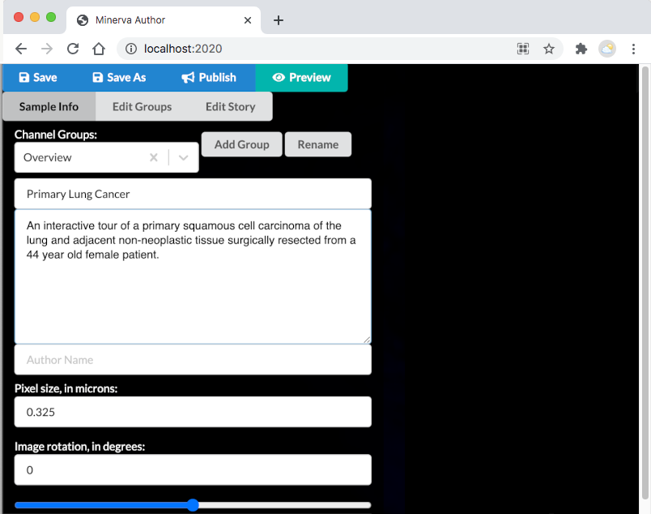

# Tutorial

This page will walk you through the steps of creating a basic **Minerva Story**, with curated channel groups and narrated waypoints. 

Before you start, it might be helpful to go over the [**Minerva Glossary**](../overview/glossary.md) to know some of the terms in this tutorial.

## STEP 0 : Requirements

Check to make sure you have the following before you start authoring your story:

1. You will need the path pointing to your **OME-TIFF image**
  - e.g. "C/Documents/Data/image_01.ome.tif"
  - This image can either be on your local computer or a mounted drive

2. [Recommended] The path to a **CSV file with marker names in one column**
  - The header of the column should be `marker_name`. See an example [*marker_name.csv file*](https://gist.githubusercontent.com/thejohnhoffer/f08eac0a9e15ad50eeb21f84276c93e4/raw/marker_names.csv).
  - *Alternatively*, you will need to know the marker names and order to add them manually.

{: .fs-5 }
{: .fw-300 }

No image data yet? No worries!

>This [example dataset](../dataset.md) contains a OME-TIFF and CSV marker file that you can use to follow this tutorial.

---

## STEP 1: Download Minerva Author

[instructions and links to download Minerva Author](../download.md){: .btn .btn-outline .btn-arrow }

---

## STEP 2: Run Minerva Author

* Unzip the downloaded file
* Run the executable:
  - On Windows, double-click on the executable file **minerva_author.exe**.
  - On MacOS, right-click and "Open" the executable file **minerva_author**.

This will open a terminal on your computer and begin running the program
 

It will also launch the program in your default browser. If your default browser not Firefox or Chrome, copy the URL from the address bar to Chrome or Firefox.

If the program does not automatically launch, then open a browser and enter `localhost:2020` into the address bar

---

## STEP 3: Import data

**Select the OME-TIFF file you wish to create a Minerva Story for**

Alternatively, if you have already started authoring a story want to return to it, select the `.story.json` file saved from the previous session.

{: .fs-3 }
{: .fw-300 }
> \*See the [FAQ page](../FAQ.md#im-seeing-a-message-about-missing-image-file-when-i-start-with-a-storyjson-file-why-does-this-happen-and-what-do-i-do) for commonly encountered questions on importing `.story.json` file.

**Select the CSV file with a list of marker names in the image**

This file must be a .csv with the [same format as the example](https://gist.githubusercontent.com/thejohnhoffer/f08eac0a9e15ad50eeb21f84276c93e4/raw/marker_names.csv).

If you start with `.story.json`, you do not need to provide a CSV file.

**Enter an output name (e.g. LUNG-3-PR) for this story.**

This string will be used in the output filenames. Avoid spaces and special characters. Underscores and dashes are ok.

{: .fs-3 }
{: .fw-300 }
> \*If you do not choose an optional output name, your story file will be named `out`.

**Click "Import" and wait for the image to be loaded in your browser**

{: .fs-3 }
{: .fw-300 }
> \*During this time, your image is being converted to smaller image tiles for faster viewing within the story. This step will take longer if your image is larger in file size.

 

---

## STEP 4: Start authoring

Minerva uses **Markdown** to format text. This means that you can bold text by adding **\*\*around to your text\*\*** and italicize by adding *\*around your text\**. 

You can also add formating elements like headings, lists and tables with **Markdown**. For more **Markdown** basics, follow the link below.

[Markdown Basics](https://labsyspharm.github.io/jekyll-tutorial/markdown-basics.html){: .btn .btn-outline .btn-arrow }{:target="_blank"}

### 4.1 Enter sample info

**Begin by giving your sample a title and a description.**

 

**This information will be displayed in the front page in the Minerva Story, along with a table of contents.**

 
	
### 4.2 Create channel groups

A channel group is a predefined group of image channels and rendering settings (color, contrast, etc.) that will be displayed at each waypoint of the Minerva story and that the users can toggle between.

**Click the "Add Group" button and enter a name for the channel group.**

 

**Then, select the channels you want to assign to the channel group.**

 

**Next, change the color for each channel.**

 

**Finish by adjusting the channel contrast using the slide bar.**

 

Create as many channel groups as you would like. You can always come back to this tab to add more.

### 4.3 Create waypoints

Now it's time to add narrative text and annotate the image. Select the "Edit Story" tab.

**Start by selecting the channel group you want displayed at this waypoint.**
 

**Then enter the title and narrative description for the waypoint.**

- When your **Minerva Story** is made public:
    - A colored underline will automatically appear when the marker name in the narrative description matches a marker in the currently active “channel groups” legend.
    - **Optionally**, you can add outgoing links on the marker names in the narrative description that lead to the GeneCard for the corresponding markers.

    > *See how to set up the links on the [Frequently Asked Questions](../FAQ.md#i-see-links-on-cell-type-and-marker-names-in-some-minerva-stories-how-can-i-add-it-to-my-story) page.*
 
 

**Add as many waypoints as you would like. You can change the zoom, pan, and add annotations such as boxes and arrows to the image.**

- Click the arrow icon  on the right of the control pane to create an arrow.
    - Then click anywhere on the image to place an arrow.
    - Click the name of the arrow at the bottom of the control pane to rename or rotate the arrow.
- Click the crosshair icon  on the right of the control pane to make a rectangular outline for any region of interest.
    - Then click and drag anywhere on the image to place the outline.

 

### 4.4 Create optional data visualizations

Adding other ways to visualize data can help you tell a more complete story.

> *If you are not adding other data visualizations, simply skip to the next step.*

[Instructions to add data visualizations](./data-visualizations.md){: .btn .btn-outline .btn-arrow } 

---

## STEP 5: Save and publish

### Save

Periodically while writing your story, you'll want to click the "Save" button to write your story's progress to a file that can later be reopened in Minerva Author to continue writing your story.

Each time you save, Minerva Author will write to a `.story.json` file to store your waypoints and channel groups.

### Publish and make your story public

Once you have completed authoring your story, click the "Publish" button to export a Minerva Story that's ready to publish. You will see the progress bar reach 100% once it is done saving. 

> *A list of expected outputs can be found [here](index.md#output)*

To make your story visible to the public, you will need to host your image pyramids, *index.html* and *story.json* files. 

There are many ways to do this. Here, we recommend using GitHub and GitHub Pages with the following steps.

### 5.1 Fork the example repository

[View the example repository for Minerva Stories here](https://github.com/thejohnhoffer/minerva-story-template/){: .btn .btn-outline .btn-arrow }

This create a copy of this repository under your account. GitHub has excellent documentation on how to fork a repository. You can follow their [instructions here](https://docs.github.com/en/get-started/quickstart/fork-a-repo).

### 5.2 Upload your data and story files

The structure of the example repository mirrors the output you will recieve from **Minerva Author**.

Click **Add File**, upload your folder of image pyramids, *index.html* and *story.json* files to your repository, **replacing** the example files. 

![Choose the Upload Files option under Add File]](../images/add-file-github.PNG)

### 5.3 Making your story public

*You are nearly there!*

Under **Settings** > **Code and Automations** > **Pages**, you can set the sources of your GitHub Page to *main* and display your site by clicking **Save**.

Your Minerva Story is ready to be viewed and shared! ✨